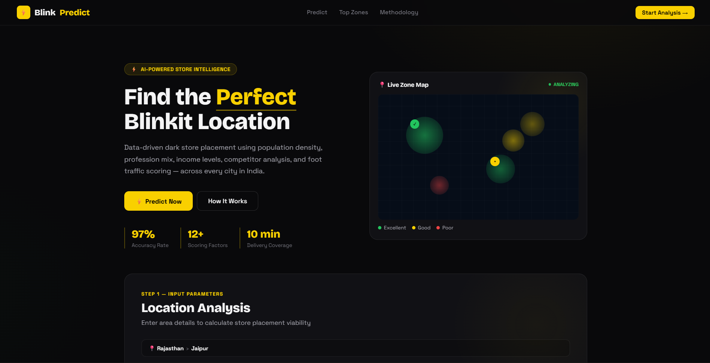

# Find the Perfect Blinkit Location
LINK - https://find-the-perfect-blinkit-location.vercel.app/
## Repository Description

**Find the Perfect Blinkit Location** is a web-based location intelligence project that helps analyze and identify the best area for opening a new Blinkit store or delivery hub.

The website uses map-based visualization and important business factors such as customer demand, accessibility, population density, competitor presence, and delivery coverage to support smarter store placement decisions.

This project demonstrates how location analysis and data visualization can help quick-commerce platforms make better expansion decisions and improve delivery efficiency.

---

## Short GitHub Description

A map-based location analysis website for finding the best Blinkit store placement area.

---

## Professional Description

**Find the Perfect Blinkit Location** is a location intelligence web application designed to analyze and suggest suitable areas for Blinkit store placement.

It considers key factors such as customer density, accessibility, nearby demand zones, competitor presence, and delivery efficiency to support data-driven decision-making for quick-commerce expansion.

---

## README Introduction

**Find the Perfect Blinkit Location** is a web-based location analysis project that helps identify the most suitable area for opening a new Blinkit store or delivery hub.

The project focuses on quick-commerce store placement by considering factors such as:

- Customer demand
- Nearby population
- Accessibility
- Competitor presence
- Delivery coverage
- Delivery efficiency

The main goal of this project is to show how map-based visualization and location intelligence can help businesses make better decisions while expanding their delivery network.

---
## Screenshot

This screenshot shows the Blinkit store placement interface, where users can view and analyze potential store locations using map-based visualization.
---

## One-Line Description for GitHub About Section

A map-based location analysis website for finding the best Blinkit store placement area.

---

## Project Objective

The objective of this project is to find the most suitable location for a Blinkit store by analyzing important business and geographical factors.

This helps improve delivery speed, increase customer reach, and support efficient store expansion planning.

---

## Features

- Interactive location-based website
- Map-based visualization
- Helps analyze suitable areas for Blinkit store placement
- Supports better decision-making for quick-commerce expansion
- Focuses on customer demand and accessibility
- Considers population density and nearby demand zones
- Helps understand delivery coverage
- Simple and user-friendly interface
- Useful for business analysis and location intelligence projects

---

## Key Factors Considered

- Customer demand
- Population density
- Nearby residential areas
- Accessibility
- Road connectivity
- Competitor presence
- Delivery coverage
- Delivery time
- Business growth potential

---

## Tech Stack

- HTML
- CSS
- JavaScript
- Map Integration
- Data Visualization

---

## Use Case

This project can be used to understand how businesses like Blinkit can choose better store or warehouse locations.

It helps in analyzing which area can provide:

- Faster delivery
- Better customer reach
- Higher demand coverage
- Efficient store placement
- Improved quick-commerce operations

---

## Final Repository Description

**Find the Perfect Blinkit Location** is a web-based location intelligence project that helps analyze and identify the best area for opening a Blinkit store or delivery hub.

The website uses map-based visualization and business factors such as customer demand, accessibility, population density, competitor presence, and delivery coverage to support smarter store placement decisions.
